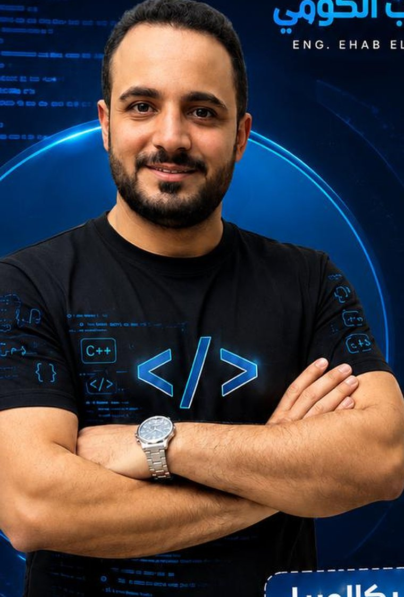

# م. إيهاب الكومي — Programming & AI SUP-Platform

<p align="center">
  
</p>

<p align="center">
  <strong>A modern, bilingual-ready landing page for a Programming &amp; AI learning platform.</strong><br />
  Built RTL-first in Arabic, engineered like software.
</p>

<p align="center">
  
  
  
  
  
</p>

<p align="center">
  <a href="#live-demo"><strong>Live Demo</strong></a> ·
  <a href="#features">Features</a> ·
  <a href="#tech-stack">Tech Stack</a> ·
  <a href="#getting-started">Getting Started</a> ·
  <a href="#project-structure">Project Structure</a>
</p>

---

## Live Demo

<p align="center">
  <a href="https://ahmed-let-front.github.io/Ehab-elkomy/">
    
  </a>
</p>


The current production build of the course platform itself lives at:
**[eng-ehab-elkomy.menassatok.com](https://eng-ehab-elkomy.menassatok.com/)**

---

## Overview

This project is the marketing / landing site for **Eng. Ehab El-Komy**'s Programming & AI course, aimed at Egyptian *Thanaweya Amma* (Grade 12) students. It's built with a real front-end toolchain — not a page builder — so it can grow like any other software project: componentized styles, a proper build step, and clean, English-first source code with Arabic-only content.

The core teaching philosophy baked into the copy: **programming is a way of thinking, not a syntax to memorize.** The site itself tries to model that — every section, from `let` vs `const` to the event loop, is written to explain the *why*, not just the *how*.

## Features

- 🌗 **Dark / light theme toggle** — persisted with `localStorage`, instant switch via CSS custom properties (no flash-of-wrong-theme on repeat visits)
- 🖱️ **Cursor spotlight & magnetic buttons** — subtle pointer-driven glow effects, respecting `prefers-reduced-motion`
- 🎬 **Scroll-reveal animations** — directional entrances (left / right / up) powered by `IntersectionObserver`, not a library
- 🧭 **Smart navigation** — desktop nav with active-section highlighting, animated hamburger-to-X, and a mobile bottom tab bar
- 💬 **Popup / modal system** — closes on `Esc`, on backdrop click, or via the close button; fully keyboard accessible
- 🧩 **Deep-dive JavaScript sections** — hoisting, the event loop, JIT compilation, `async`/`await` — explained with real annotated code samples
- 🧠 **"Vibe Coding Era" section** — a pitch for planning, user stories, flowcharts, and architecture *before* prompting an AI to write code
- 🗺️ **Curriculum roadmap** — a visual, step-by-step timeline from fundamentals to an AI-assisted final project
- 💚 **WhatsApp-first contact flow** — the contact form composes a pre-filled WhatsApp message instead of requiring a backend
- ♿ **Accessible by default** — semantic landmarks, visible focus states, skip link, and ARIA labeling throughout

## Tech Stack

| Layer       | Choice                                              |
| ----------- | ---------------------------------------------------- |
| Build tool  | [Vite](https://vitejs.dev/)                           |
| Styling     | [Tailwind CSS v4](https://tailwindcss.com/) via `@tailwindcss/vite` |
| Fonts       | [Fontsource](https://fontsource.org/) (Cairo, IBM Plex Sans Arabic, JetBrains Mono) — self-hosted, no external font CDN |
| Icons       | Inline SVG sprite (`sprite.svg`) |
| Scripting   | Vanilla JavaScript (ES2023+, native ES Modules) — no framework, no runtime dependencies |
| Deployment  | Static output — deployable to Vercel, Netlify, GitHub Pages, or any static host |

No CDNs, no jQuery, no UI kit. Everything ships from `node_modules` and gets bundled by Vite.

## Getting Started

### Prerequisites

- [Node.js](https://nodejs.org/) 18 or later
- npm (or your package manager of choice)

### Installation

```bash
npm install
```

### Development

```bash
npm run dev
```

Opens a local dev server with hot module replacement.

### Production Build

```bash
npm run build
```

Outputs an optimized static build to `dist/`.

### Preview the Production Build

```bash
npm run preview
```

## Project Structure

```
.
├── public/
│   └── instructor.jpg        # Served as-is at the site root
├── src/
│   ├── main.js                # App entry — theme toggle, nav, popups, animations
│   └── styles.css              # Tailwind entry + design tokens + @layer components
├── index.html                  # Single-page markup, semantic HTML
├── sprite.svg                   # Shared inline SVG icon sprite
├── vite.config.js
├── package.json
└── README.md
```

## Customization

- **Colors & fonts** — every color is a CSS custom property defined once in `src/styles.css` under `@theme` and `[data-theme="light"]`. Change a value there and it propagates through every Tailwind utility built from it (`bg-electric`, `text-mist`, etc.).
- **Repeated utility groups** — anything reused more than once (cards, section headings, code windows, buttons) lives in `@layer components`, so the markup in `index.html` stays short and readable.
- **Content** — all visible copy is Arabic and lives directly in `index.html`; all class names, IDs, and comments are English, so the codebase stays legible to any contributor regardless of language.
- **Contact number** — the WhatsApp number is set in a couple of places in `index.html` and `src/main.js`; search for `201145383426` to update it everywhere.

## Contact

- **WhatsApp:** [01145383426](https://wa.me/201145383426)
- **Platform:** [eng-ehab-elkomy.menassatok.com](https://eng-ehab-elkomy.menassatok.com/)

## License

MIT — feel free to fork and adapt for your own course platform.
